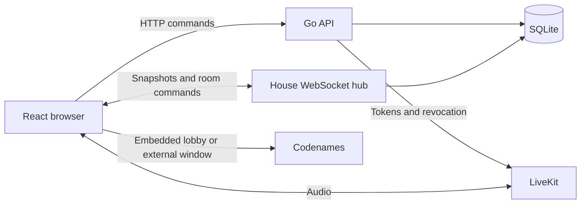

# How Roomcade keeps a House in sync

Roomcade runs as one Go process serving an HTTP API, WebSocket connections, and the built React app. SQLite stores durable state. LiveKit handles audio, and Codenames hosts the game itself.

## Durable state and presence have different lifetimes

The schema in [store.go](../internal/app/store.go) persists sessions, Houses, rooms, memberships, invitations, join requests, games, and cached idempotency responses. SQLite uses WAL mode, foreign keys, a five-second busy timeout, and a single database connection.

Connections and recovery timers belong to the in-memory hub. Restarting the process drops those connections, but the next connection gets a fresh snapshot built from the database. There is no event log to replay. Timers restart through connection handling rather than surviving the restart themselves.

Snapshots carry a durable House revision and a separate presence version. During a connection, the browser compares both before accepting an update. The first snapshot after reconnect establishes a new baseline. Snapshots are built per member so host-only pending requests are not sent to ordinary members.

Full snapshots are reasonable for a House capped at eight people and four rooms. They simplify reconnects at the cost of repeated queries and payloads. Raising those limits would require measuring broadcast cost.

## A stale game edit fails explicitly

A game mutation includes the revision the browser last saw. `setGame` reads the current revision inside its transaction and rejects a mismatch. An accepted update changes the game and increments the House revision before commit.

For example, if two clients both read game revision 3, the first accepted replacement writes revision 4. The second replacement still expects 3 and receives a conflict instead of silently overwriting the first.

These revisions belong to a game row. Clearing a game deletes that row, and recreating it starts at revision 1. A revision is therefore not a permanent identifier across game deletion and recreation; a persistent room-level generation would close that gap.

## Approval is the membership boundary

Possessing an invite permits a join request, not access to the House. Host approval checks the pending request and available capacity, inserts membership, updates the request, and increments the House revision in one transaction. Invite rotation increments the invitation generation and revokes pending requests.

Session and invite tokens are hashed for lookup. Guest cookies are HttpOnly and SameSite=Lax; production configuration must enable Secure cookies. The backend checks membership and role for protected operations. UI permissions are only a presentation of those decisions.

## Coordination is deliberately local

The application shares one command mutex across authenticated HTTP handlers, WebSocket command handling, and recovery callbacks. Together with a single SQLite connection, this makes the ordering of local operations easier to reason about. It also serializes work across unrelated Houses.

Broadcasts currently write to clients sequentially, with a five-second timeout for each write. Some broadcasts happen while the command lock is held, so a slow client can delay other requests. Per-client bounded outbound queues would be a useful next improvement; their overflow policy should disconnect a lagging client and let it resync.

Multiple application replicas are not supported by this design. Per-House coordination, shared presence ownership, and a database concurrency strategy would all need attention before adding replicas.

## Recovery has explicit rules

A new connection replaces the previous connection for the same session within a House. Detaching an old connection checks identity before removing it, so closing a replaced tab does not detach its replacement.

When a host disconnects, a 30-second grace period gives that host time to reconnect. If the host remains absent and other members are connected, the hub transfers the role by join time, using member ID to break ties. Game coordinators have separate recovery logic. Roomcade host authority and Codenames admin authority are independent.

For room changes, the browser sends a transition ID and waits for acceptance or rejection. The server checks the destination and revokes the previous voice identity before changing rooms. A voice-provider revocation failure rejects that transition; it is not silently ignored.

## Retry handling has a crash window

House creation caches a response by session and idempotency key for 24 hours. A normal replay returns the existing House without retaining its raw invitation token; the host can rotate the invite.

House creation and saving the cached response use separate commits. A crash between them can leave a created House without a replay record. Moving both writes into one transaction, and binding a key to its operation and request payload, would strengthen this behavior. The current implementation does not provide exactly-once execution.

## What the tests establish

The repository tests exercise a real temporary SQLite database. They check URL validation, room capacity, a persisted lobby, stale deletion, successful approval, and rejection once membership is full. Running with the Go race detector checks the paths exercised by those tests; it does not establish coverage of concurrent WebSocket behavior.

The next useful integration tests are simultaneous approvals for the final member slot, host disconnect/reconnect around the grace deadline, duplicate-tab replacement during a room switch, and restart recovery. Hosted audio and backup restoration also need their own verification. See the [release checklist](completion-plan.md).
